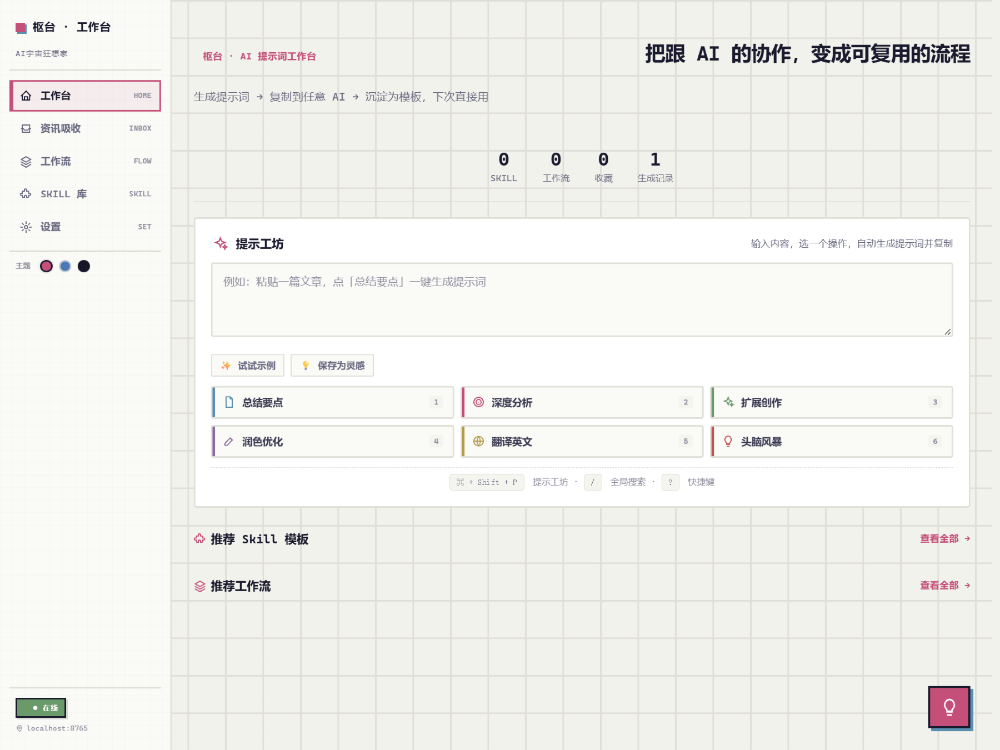
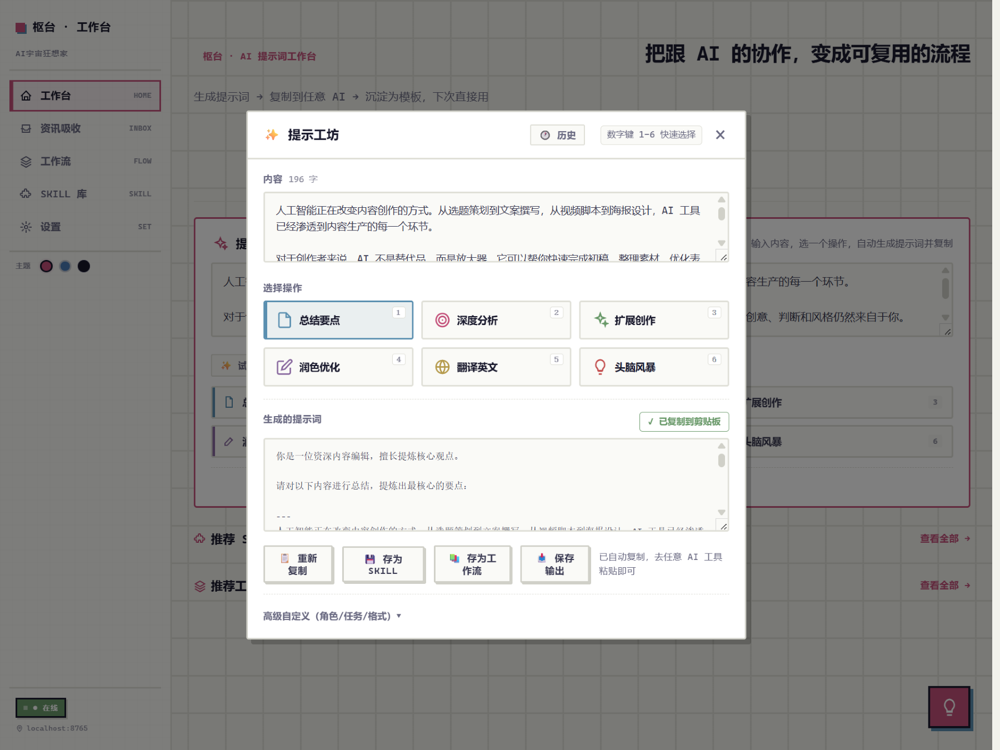
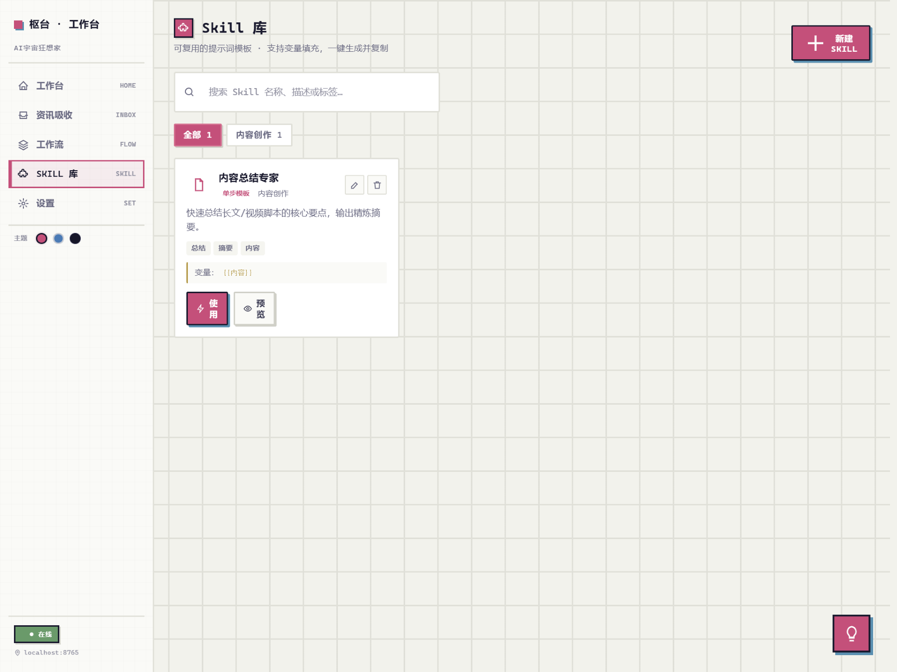
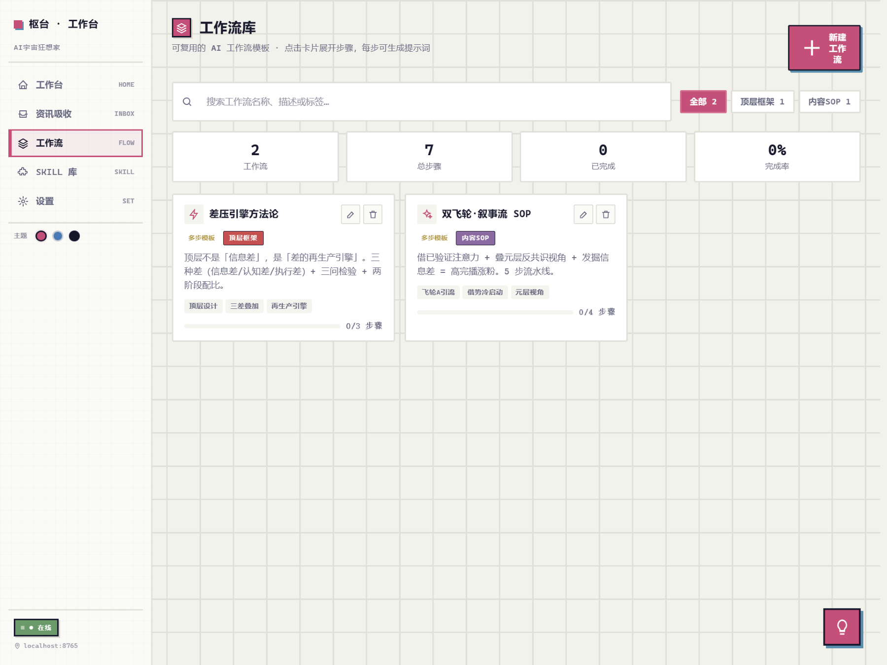
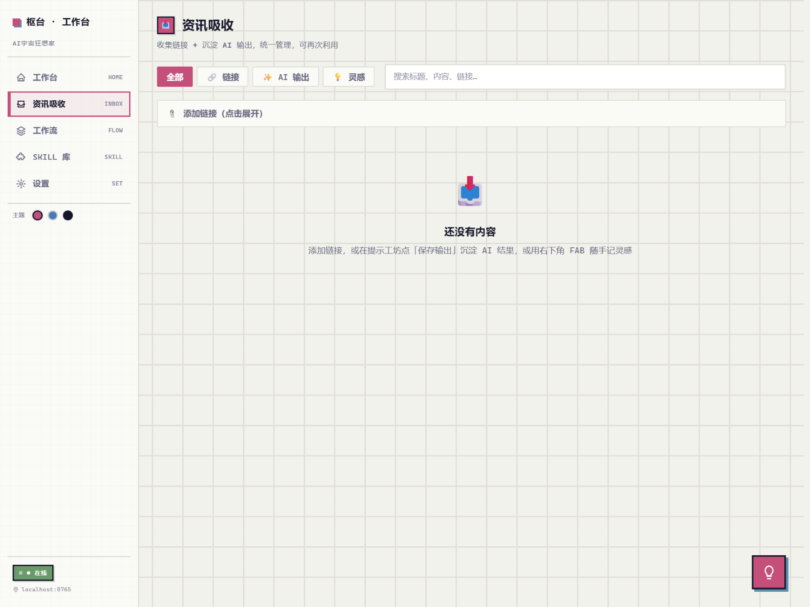

# 枢台 · AI 提示词工作台

> 不是另一个 AI，而是 AI 的工作台。生成提示词 → 复制到任意 AI → 沉淀为模板，下次直接用。

[](https://opensource.org/licenses/MIT)
[](https://nodejs.org/)
[]()

---

## 📸 截图

| 工作台 | 提示工坊 |
|---|---|
|  |  |

| Skill 库 | 工作流 | 资讯吸收 |
|---|---|---|
|  |  |  |

---

## ✨ 核心功能

### 🎯 提示工坊 — 一键生成提示词
输入内容，选一个操作，自动生成高质量提示词并复制到剪贴板。
- **6 种预设操作**：总结要点 / 深度分析 / 扩展创作 / 润色优化 / 翻译英文 / 头脑风暴
- **自动复制**：生成即复制，直接粘贴到任意 AI
- **历史记录**：生成过的提示词可快速复用
- **快捷键**：`Cmd+Shift+P` 随时打开

### 🧩 Skill 库 — 单步提示词模板
把好用的提示词存为 Skill，支持变量填充，一键生成。
- 分类管理 / 搜索筛选
- 变量占位符 `{{变量名}}`
- 空状态引导，新手友好

### 📚 工作流 — 多步骤 AI 任务
复杂任务拆成多步骤，每步生成提示词，按顺序执行。
- 步骤进度持久化（刷新不丢失）
- 一键执行全部步骤
- 分类 / 搜索 / 统计

### 📥 资讯吸收 — 沉淀 AI 输出
统一管理链接、AI 输出、灵感，支持二次沉淀。
- 🔗 链接收集（待导入/已导入）
- ✨ AI 输出保存（从提示工坊一键保存）
- 💡 灵感速记（FAB 悬浮按钮）
- 分类筛选 / 全局搜索
- AI 输出可「存为 Skill」二次沉淀

### 🔍 全局搜索
按 `/` 键打开，快速搜索 Skill 和工作流，点击直接使用。

### 📊 使用统计
首页一目了然：Skill 数 / 工作流数 / 收藏数 / 生成记录数。

### 💾 数据导出/导入
完整的数据备份和恢复，支持合并导入，不覆盖现有数据。

### 🎨 主题切换
豆沙粉 / 雾霾蓝 / 深空黑，三种主题随心切换。

### 👋 新手引导
首次打开 3 步引导，快速上手。设置页可随时重新查看。

### 📱 响应式适配
桌面端 / 平板 / 手机，都能流畅使用。

---

## 🚀 快速开始

### 环境要求
- Node.js >= 18.0.0

### 3 步跑起来

```bash
# 1. 克隆项目
git clone https://github.com/yourname/shutai.git
cd shutai

# 2. 启动（零依赖，无需 npm install）
node server.js

# 3. 打开浏览器
# http://localhost:8765
```

首次启动会自动从 `config.example.json` 生成 `config.json`。

---

## ⌨️ 快捷键

| 快捷键 | 功能 |
|---|---|
| `Cmd+Shift+P` | 打开提示工坊 |
| `/` | 全局搜索 |
| `?` | 快捷键帮助 |
| `1-6` | 提示工坊中快速选择操作 |
| `Esc` | 关闭弹窗 |

> Windows 用户将 `Cmd` 替换为 `Ctrl`。

---

## 📁 项目结构

```
shutai/
├── server.js              # 零依赖 Node 服务（内置 http）
├── config.example.json    # 配置模板
├── package.json
├── public/
│   ├── index.html         # 主入口
│   ├── css/
│   │   ├── base.css       # 变量 / Reset / 布局 / 排版
│   │   └── components.css # 卡片 / 按钮 / 标签 / 列表 / 弹窗
│   └── js/
│       ├── main.js        # 入口 / 导航 / 页面调度 / FAB / 全局搜索
│       ├── api.js         # API 封装
│       ├── store.js       # 状态管理（intake/ideas）
│       ├── prompt-builder.js  # 提示工坊核心
│       ├── icons.js       # SVG 图标库
│       └── pages/
│           ├── hub.js         # 工作台（首页）
│           ├── intake.js      # 资讯吸收
│           ├── methodology.js # 工作流
│           ├── skills.js      # Skill 库
│           └── settings.js    # 设置
├── data/                  # 模板数据（可版本控制）
│   ├── skills.json
│   └── methodology.json
└── .state/                # 运行时状态（gitignore）
    ├── intake.json
    └── ideas.json
```

---

## ⚙️ 配置

编辑 `config.json`：

```json
{
  "port": 8765,
  "title": "枢台 · 工作台",
  "subtitle": "",
  "brand": "",
  "dataDir": "./data",
  "stateDir": "./.state"
}
```

| 字段 | 说明 |
|---|---|
| `port` | 服务端口，默认 8765 |
| `title` | 页面标题 |
| `brand` | 底部品牌标识 |
| `dataDir` | 模板数据目录 |
| `stateDir` | 运行时状态目录 |

---

## 🔒 数据与隐私

- **本地优先**：所有数据存储在本地，不上传任何服务器
- **零依赖**：不使用任何第三方分析、追踪服务
- **可导出**：设置页可随时导出全部数据为 JSON
- **可自托管**：部署在自己的设备上，完全掌控数据

---

## 🛠️ 技术栈

- **后端**：Node.js 内置 `http` 模块，零依赖
- **前端**：原生 HTML / CSS / JavaScript，无框架
- **存储**：本地 JSON 文件 + localStorage
- **图标**：内联 SVG，无外部资源

---

## 🤝 贡献

欢迎贡献！你可以：

1. ⭐ 点个 Star
2. 🐛 提交 Issue 反馈 Bug
3. 💡 提出功能建议
4. 🔧 提交 PR 改进代码
5. 📝 完善文档

### 开发指南

- 代码风格：简洁、可读、注释清晰
- 新增页面：在 `public/js/pages/` 下创建，在 `main.js` 中注册
- 新增数据类型：在 `data/` 下创建 JSON，通过 `getData('key')` 访问

---

## 📄 License

[MIT](https://opensource.org/licenses/MIT) — 可自由使用、修改、分发。

---

## 🙏 致谢

感谢所有开源社区的贡献者，以及每一个使用枢台的你。

---

> **把跟 AI 的协作，变成可复用的流程。**
